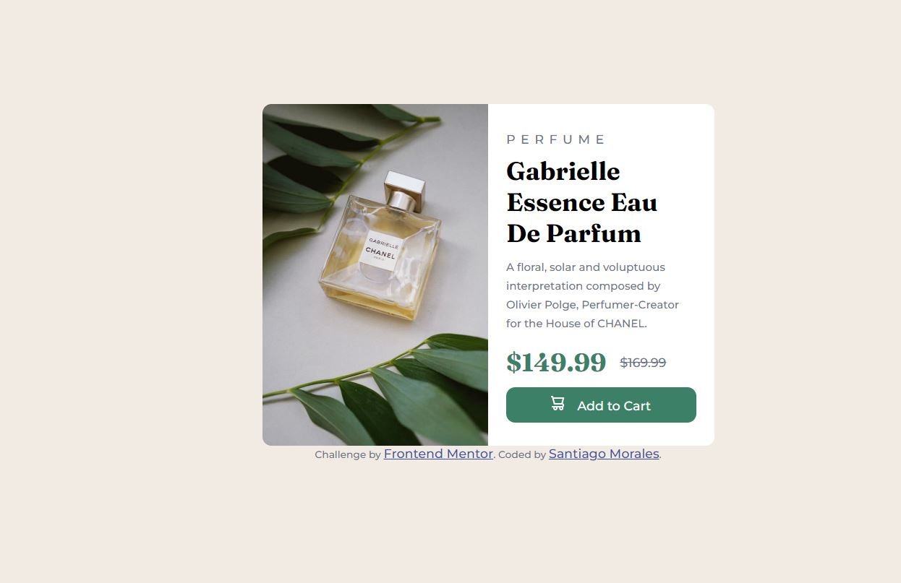

# Frontend Mentor - Product preview card component solution

This is a solution to the [Product preview card component challenge on Frontend Mentor](https://www.frontendmentor.io/challenges/product-preview-card-component-GO7UmttRfa). 

## Table of contents

- [Overview](#overview)
  - [The challenge](#the-challenge)
  - [Screenshot](#screenshot)
  - [Links](#links)
- [My process](#my-process)
  - [Built with](#built-with)
  - [What I learned](#what-i-learned)
  - [Continued development](#continued-development)
  - [Useful resources](#useful-resources)
- [Author](#author)
- [Acknowledgments](#acknowledgments)


## Overview

### The challenge

Users should be able to:

- View the optimal layout depending on their device's screen size
- See hover and focus states for interactive elements

### Screenshot





### Links

- Solution URL: [Solution URL](https://github.com/Aleroms/FrontendMentor-Projects)
- Live Site URL: [Live Site URL](https://nimble-kheer-3aa443.netlify.app/)

## My process
Start with what I knew and work from there. I started creating a container and then putting all given info into h2,h1,divs,etc. Then, started styling that.

One of my struggles was incorrectly targeting an image. I struggled for a while not understanding why my image was overflowing outside its parent container. I inspected the image and saw that there was no styling on it when I realized it was suppose to be img instead of image.

Afterwards, I did margin and padding of elements. And finished off doing media query for desktop size.

### Built with

- Semantic HTML5 markup
- CSS custom properties
- Flexbox
- CSS Grid
- Mobile-first workflow

### What I learned
At first, it was really difficult because I did not know how to start the project. So I looked up some resources on how to approach the problem. By doing the html "structure" first before trying to style it, the problem became more managable. After I got help I decided to restart the project on my own to see how I could apply what i've learned.


Use this section to recap over some of your major learnings while working through this project. Writing these out and providing code samples of areas you want to highlight is a great way to reinforce your own knowledge.

To see how you can add code snippets, see below:

```html
<h1>Some HTML code I'm proud of</h1>
```
```css
.proud-of-this-css {
  color: papayawhip;
}
```
```js
const proudOfThisFunc = () => {
  console.log('🎉')
}
```

### Continued development

I learned that I need to do research on the html basics like flex and grid. Fun challenge.

### Useful resources

- [Product Preview Card Component - Frontend Mentor Challenge - YouTube](https://www.youtube.com/watch?v=BMOH4zSLTnQ&t=1834s) - This helped me because I had no clue how to start.


## Author

- Website - [Add your name here](https://www.your-site.com)
- Frontend Mentor - [@Aleroms](https://www.frontendmentor.io/profile/Aleroms)

## Acknowledgments
Thanks to tsbsankara for the help