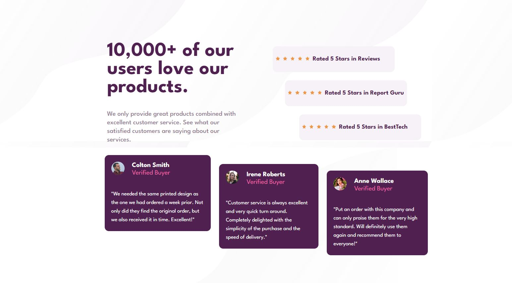

# Frontend Mentor - Social proof section solution

This is a solution to the [Social proof section challenge on Frontend Mentor](https://www.frontendmentor.io/challenges/social-proof-section-6e0qTv_bA). Frontend Mentor challenges help you improve your coding skills by building realistic projects. 

## Table of contents

- [Overview](#overview)
  - [The challenge](#the-challenge)
  - [Screenshot](#screenshot)
  - [Links](#links)
- [My process](#my-process)
  - [Built with](#built-with)
  - [What I learned](#what-i-learned)
- [Author](#author)

## Overview

### The challenge

Users should be able to:

- View the optimal layout for the section depending on their device's screen size

### Screenshot

### Links

- Live Site URL: [Netlify](https://classy-cheesecake-8ca05d.netlify.app/)

## My process
This project has been grander than all the previous [frontendmentor](https://www.frontendmentor.io/profile/aleroms) projects. I started it off with sketching a layout considering the box model. Additionally, I set the `background-color` of the parent element so it could be easier to identify each section and I tried to choose padding over margin where I thought it made more sense.
I started with a mobile-first approach while taking into consideration the desktop view as well; creating `html 
`s, `html <article>`s or `html <section>`s where I thought most appropriate. In the end, this project did take longer than others because of my planning and execution.
### Built with

- Semantic HTML5 markup
- CSS custom properties
- Flexbox
- CSS Grid
- Mobile-first workflow

### What I learned
larger projects take more planning, imo. Some sections would be better if done through React, such as my Card and Review sections. The code would be cleaner.
## Author

- Frontend Mentor - [@aleroms](https://www.frontendmentor.io/profile/aleroms)
